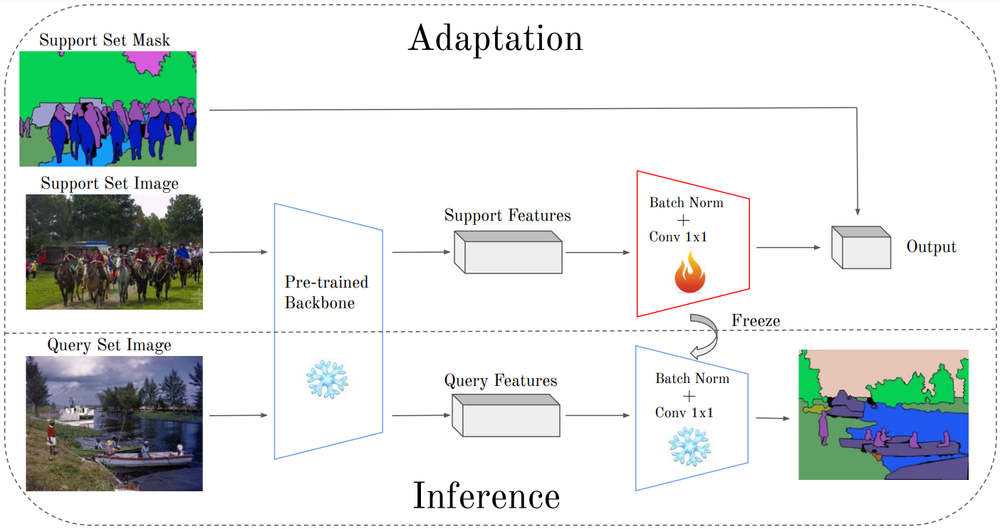

<h1 align='center' style="text-align:center; font-weight:bold; font-size:2.0em;letter-spacing:2.0px;"> A Novel Benchmark for Few-Shot Semantic Segmentation in the Era of Foundation Models </h1>

<p align='center' style="text-align:center;font-size:1.25em;">
    <a href="https://scholar.google.com/citations?user=InQw64sAAAAJ&hl=fr" target="_blank" style="text-decoration: none;">Reda Bensaid<sup>1,2</sup></a>&nbsp;,&nbsp;
    <a href="https://scholar.google.com/citations?user=n3IKEqgAAAAJ&hl=fr" target="_blank" style="text-decoration: none;">Vincent Gripon<sup>1</sup></a>&nbsp;,&nbsp;
    <a href="https://scholar.google.ca/citations?user=SQrTW_kAAAAJ&hl=en" target="_blank" style="text-decoration: none;">François Leduc-Primeau<sup>2</sup></a>&nbsp;
    <a href="https://scholar.google.com/citations?user=ivJ6Tf8AAAAJ&hl=de" target="_blank" style="text-decoration: none;">Lukas Mauch<sup>3</sup></a>&nbsp;,&nbsp;
    <a href="https://scholar.google.fr/citations?user=FwjpGsgAAAAJ&hl=fr" target="_blank" style="text-decoration: none;">Ghouthi Boukli-Hacene<sup>3,4</sup></a>&nbsp;,&nbsp;
    <a href="https://scholar.google.com/citations?user=UFl8n4gAAAAJ&hl=de" target="_blank" style="text-decoration: none;">Fabien Cardinaux<sup>3</sup></a>&nbsp;,&nbsp;
	<br>
<sup>1</sup>IMT Atlantique&nbsp;&nbsp;&nbsp;
<sup>2</sup>Polytechnique Montréal&nbsp;&nbsp;&nbsp;
<sup>3</sup>Sony Europe, Stuttgart Laboratory 1&nbsp;&nbsp;&nbsp;
<sup>4</sup>MILA&nbsp;&nbsp;&nbsp;

</p>

<p align='center';>

</p>
<p align='center' style="text-align:center;font-size:2.5 em;">
<b>
    <a href="https://arxiv.org/abs/2401.11311" target="_blank" style="text-decoration: none;">[Paper]</a>&nbsp;&nbsp;&nbsp;&nbsp;&nbsp;&nbsp;
</b>
</p>




## Requirements
### Installation
```
python3 -m venv fss_env
source fss_env/bin/activate

pip install -r requirements.txt
```

### Dataset
Follow [DATASET.md](DATASET.md) for instructions on how to download the different datasets.

## Get Started
### Configs
The running configurations can be modified in `configs`. 

### Running
For DINOv2 with linear probing on cityscapes:
```bash
   python3 train.py --models DINO --methods linear --dataset cityscapes --nb-shots 1 --lr 0.2
```
Possible models : DINO, SAM, SEGFORMER, IBOT, CLIP, ResNet, MAE. (for some methods, you need to clone the official repo of the method and change the path `model_repo_path` in `configs`, except for ResNet and SegFormer, for which you don't need to clone a repo).

For the backbones, they can be downloaded from their official repo, after that change the `model_path` in `configs`

Possible methods : linear, multilayer, svf, lora, finetune.

Possible datasets : cityscapes, coco, ppdls.


## Acknowledgement

This repo benefits from [RegSeg](https://github.com/RolandGao/RegSeg).

## Citation
```latex
@misc{bensaid2024novelbenchmarkfewshotsemantic,
      title={A Novel Benchmark for Few-Shot Semantic Segmentation in the Era of Foundation Models}, 
      author={Reda Bensaid and Vincent Gripon and François Leduc-Primeau and Lukas Mauch and Ghouthi Boukli Hacene and Fabien Cardinaux},
      year={2024},
      eprint={2401.11311},
      archivePrefix={arXiv},
      primaryClass={cs.CV},
      url={https://arxiv.org/abs/2401.11311}, 
}
```

## Contact

If you have any question, feel free to contact reda.bensaid@imt-atlantique.fr.
